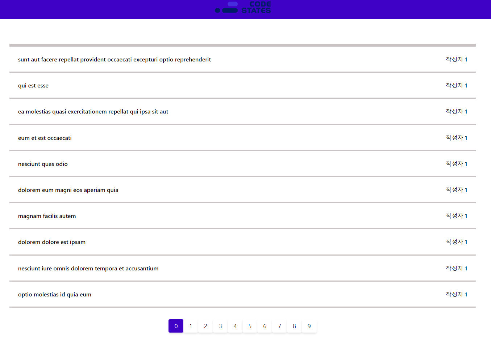
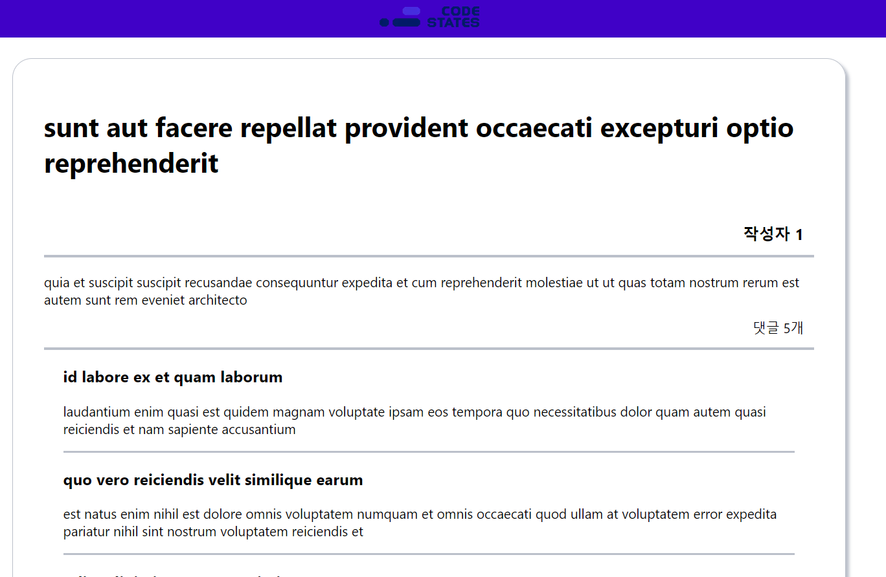
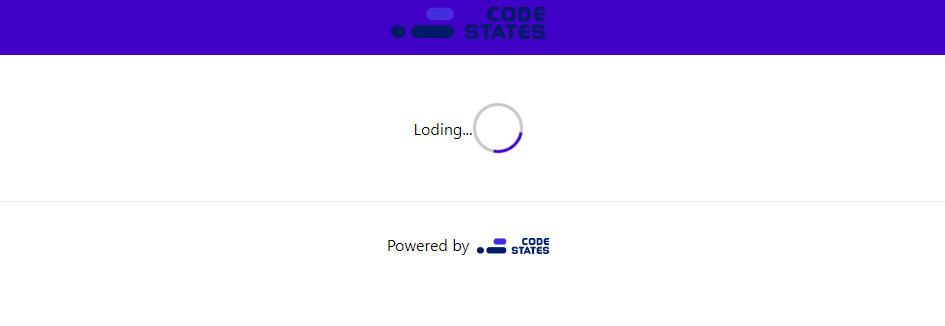

[배포 사이트](https://codestates-fe-advanced-course-ten.vercel.app/)

## Getting Started

```bash
npm install
# or
yarn install
```

```bash
npm run dev
# or
yarn dev
```

# 기술 스택

- React
- CSS
- NEXT.js
- Axios

## Deploy on Vercel

# 구현한 기능 목록

- 메인 페이지
  

- 포스트 페이지
  

- 로딩 페이지
  

# 어려웠던 점

순수 css 구현이 생각보다 찾아볼게 많았습니다.

# 추가 구현 사항

- 페이지 네이션

# 소요 시간

- 5시간
